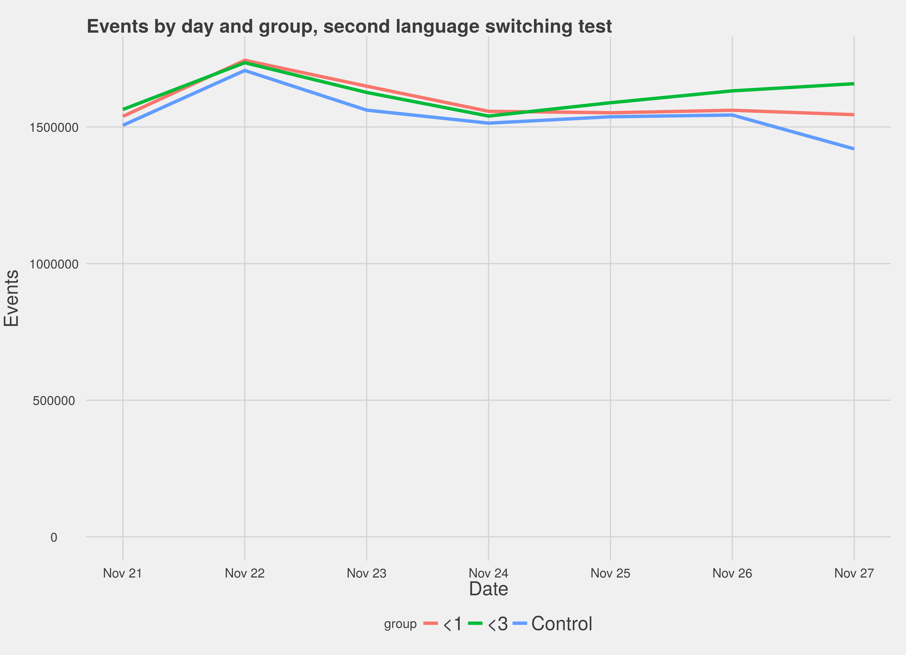
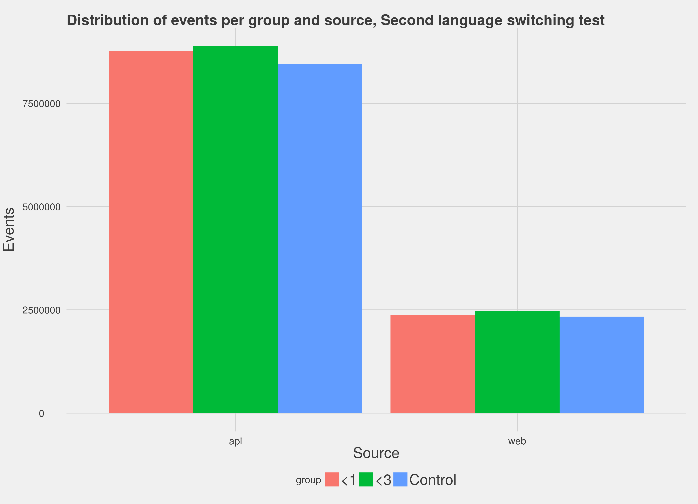

## Summary

This was an A/B test to determine the impact of switching search languages in the case that a query produces zero results, and in the case that a query produces fewer than 3 results, depending on the test group. This followed an earlier test that just applied this to queries producing zero results. Our hope was that applying language detection methods to failed queries would let us, for a subset, identify that they were using the wrong language, switch them over to the correct one, and get them results - and that new data collection methods would let us produce a more certain result than the last test.

We found very promising evidence that, for those queries the language detection could actually be applied to, this makes a remarkable difference to the zero results rate. We recommend that a user-side A/B test be run to look at the clickthrough rate when language detection is applied, to ensure that it produces *useful* results, not just some results.

## Background

One of the core goals of the Discovery team is to improve the Zero Results Rate - the proportion of user searches that return no results. After examining failed queries we noticed that some queries were perfectly valid, but simply in the wrong language; accordingly, we concluded that if we *detected* the user's language and re-ran their query, over indexes in that language, we would be able to reduce the zero results rate.

We launched a test that collected data from 4 November 2015 to 11 November 2015, running over 1 in 10 queries. Half of the search queries (the control group -- variation "A") were given the *status quo* ; half (the test group -- variation "B") would have language detection methods and a second search query if their query produced 0 results. Over a week of testing this produced 25,348,283 events. The analysis showed that this did not have a substantial impact on the zero results rate.

One hypothesis for this lack of impact was that the language detection was being applied to so few queries (and so few queries were eligible) that the impact of the change just vanished into noise.

## Data Collection

To check our hypothesis we ran a second A/B test, from 21 November to 27 November 2015. This contained two test groups; one would have language detection applied with zero (<1) results, one with less than 3 (<3) results. In both cases, query metadata was added to indicate whether a search would have had language detection applied. We hoped that with these additional datapoints (and a wider population) we could see the impact. This test generated 33,282,741 queries.

### Data Verification

Our first task is to explore the data to make sure, amongst other things, that sampling worked correctly. If it did not, the test groups may not be comparable with the non-test group.

First, we looked at things on a by-day basis; for each day in the test, how many events <!-- As an aside, wouldn't it be clearer to refer to them as queries rather than events? Especially since we use 'events' to refer to user actions logged with EL. --> <!-- we use events to refer to user actions, full stop; that's why it's used here. Referring to them as queries means intentional vagueness since these can be multiple queries. --> do we have in each group?

There is some uneveness, but not substantial amounts. <!-- There is so much empty, useless space in this figure. It would benefit significantly from different y limits. --> <!-- using different Y limits means distorting the graph and making the difference between groups appear tremendous --> If we look at events by source:

We see the same discrepancy, which is being explored separately, but again, it is not on such a scale to make us worry about the viability of the data.

## Results

### <1 search results

First we compare the control group to the group that was exposed to language detection if they got zero results. Looking at the population as a whole we see no substantial improvement; whether we filter down to just API or just web requests, or look at the entire population, there's no real increase in the probability of a successful outcome.

However, if we look just at those queries eligible for language detection, we see a remarkable improvement; users eligible for language detection who were exposed to it are **3.5-6** times more likely to get results than the baseline population.

This discrepancy is likely to be because the sheer volume of queries was drowning out this positive outcome; we didn't see a big improvement for the group overall because most people in the test group and control could never have received the language detection. It's akin to testing a cure for the plague: you're much more likely to see a health improvement if you give it to people who *actually have the plague*. It's probably not going to improve the health of those who don't.

### <3 search results

With the <3 results, we compare to the control not to see which population got fewer "zero results" outcomes than the other, but which got
fewer "<3 results" outcomes. When we make that comparison, we see no substantial improvement in outcome, either for the entire group or those eligible for language detection. One hypothesis for this is that language detection is more likely to be wrong. If someone is already getting 1-2 results, what they searched for is probably at least vaguely sensical in that project's language. Switching it is unlikely to be helpful.

## Conclusion

The improvement for the population that was previously getting zero results is dramatic, and should be explored further. It is not, in and of itself, conclusive - that results were found does not indicate the results were any *good*.

Our recommendation is that we conduct another test, this one aimed at the <1 group, conducted through EventLogging, and looking at the actual clickthrough rate and time spent on clicked-through pages, to try and understand if the results we are giving people through language detection are actually useful.

## Discussion

Furthermore, we highly recommend that we stop running this kind of test. Ignoring implementation and process problems (which were substantial) there is no need for it. A/B tests directly facing users are for changes where user input is needed: checking whether a change produces more results does not require user input, it requires user queries, which can be run on the relevance lab (if it is properly built out). With this, we would be able to avoid issues around temporality and sample groups, while dramatically reducing the complexity of running tests, allowing us to easily correct for issues we spot after the fact by running the test again (modified).

User-facing tests should be held for the clickthrough rate, page visitation time, and other analyses of user behavior data we must observe rather than simulate. Checking the results count is not one of those situations.
